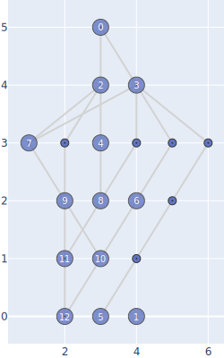
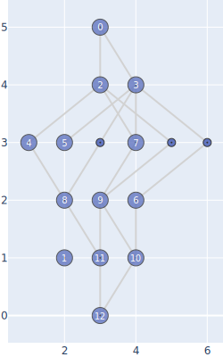
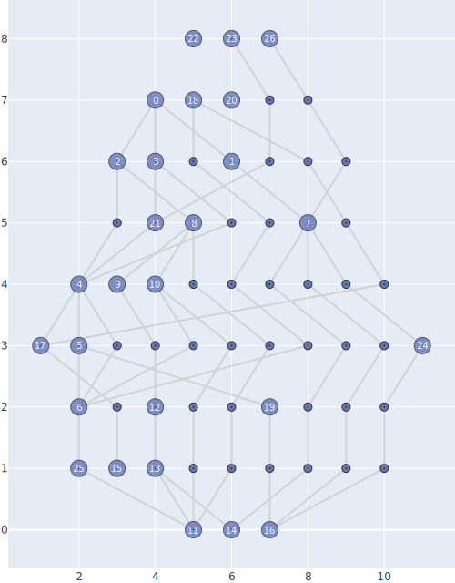
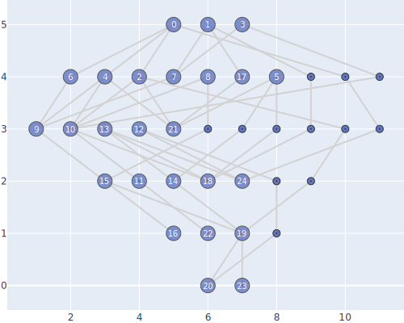

## Визуализация ациклических орграфов

Реализован алгоритм Грэхема-Коффмана уложения вершин графа по слоям при наличии ограничения на допустимую ширину слоя, при отсутствующем ограничении реализован алгоритм минимизации dummy-вершин. После укладки по слоям добавляется нужное число dummy-вершин и эвристическими средствами минимизируется число пересечений ребер графа (начальный порядок вершин определяется барицентрическим методом, далее используется локальный жадный поиск улучшения для соседних слоев).

Граф считывается из формата GraphML, на выходе алгоритма SVG-картинка с визуализацией.
Укладка по слоям рисуется сверху вниз.

## Запуск кода

### Запуск ноутбука на колабе 

### Запуск скрипта
python digraphviz.py -gp ./graph_examples/from_book.xml -ip ./results/graham_coffman/from_book.svg -mw 3

Параметры:
1. GraphPath (-gp) - путь к xml-файлу с графом в GraphML-формате
2. ImagePath (-ip) - путь к файлу с изображением-результатом (предпочтительный формат - SVG)
3. MaxWidth (-mw) - ограничение на ширину слоя (опциональный параметр)
## Примеры работы

Примеры графов содержатся в директории ./graph_examples, результаты для них - в директориях ./results/graham_coffman и ./results/dummy_minimized .

Пример из книги (Грэхем-Коффман, ограничение на ширину - 3):

Пример из книги (Минимизация количества dummy-вершин):

Пример 1 (Грэхем-Коффман, ограничение на ширину - 3):

Пример 1 (Минимизация количества dummy-вершин):

Пример 2 (Грэхем-Коффман, ограничение на ширину - 3):

Пример 2 (Минимизация количества dummy-вершин):

