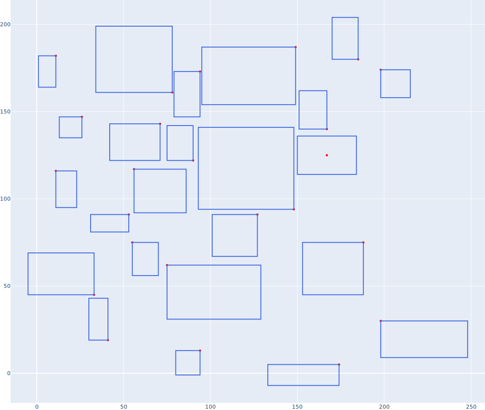
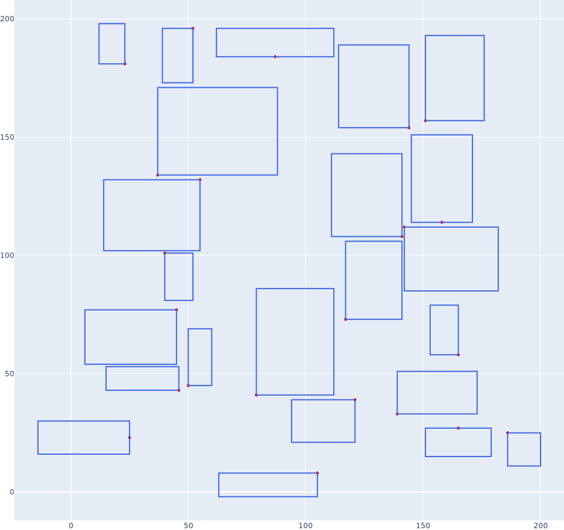
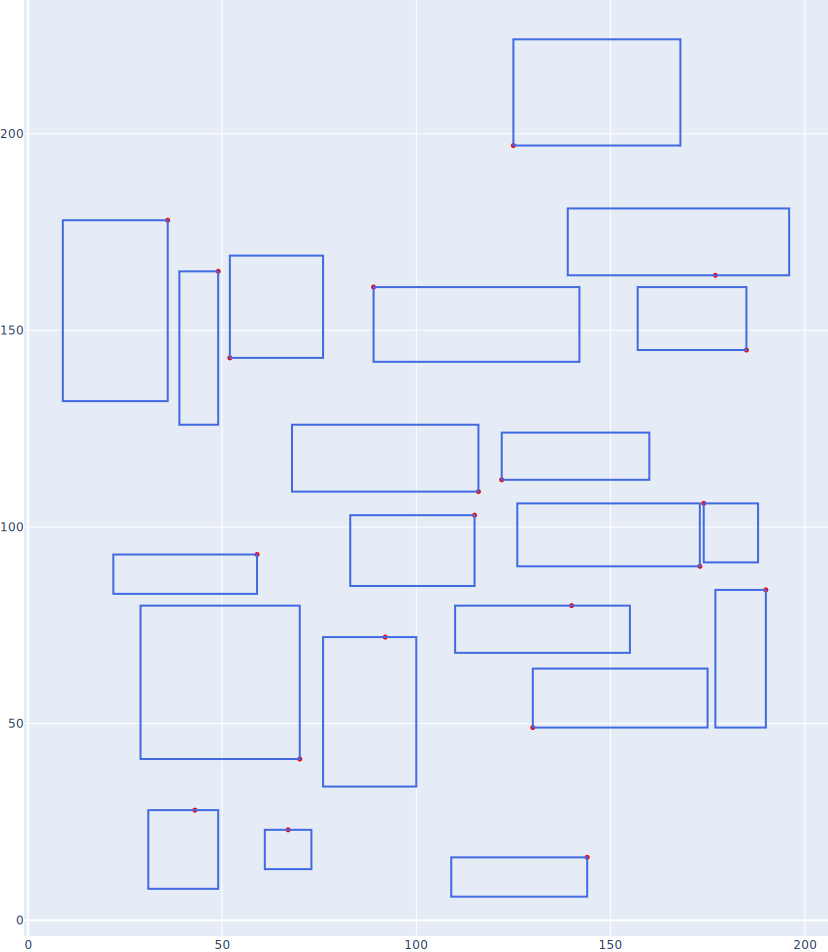
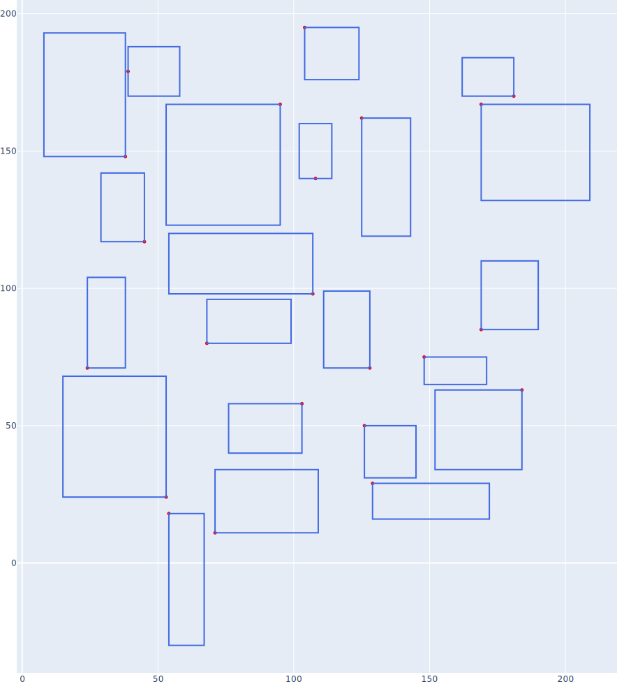
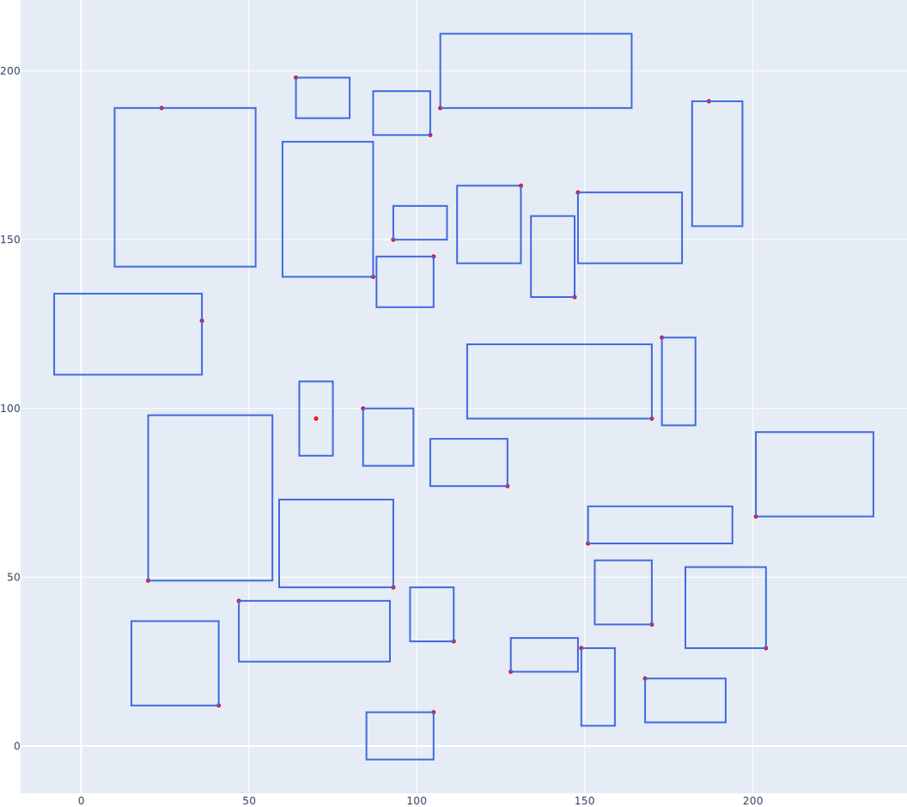

## Расположение меток/подписей (label placement) 

Задача размещения подписей (label placement) решена в постановке: задается множество точек, для которых известны размеры прямоугольника подписи, а также варианты расположения самой точки внутри прямоугольника (таких вариантов может быть не более двух). Задача сводится к решению 2-SAT (распределению значений булевых переменных так, чтобы они удовлетворяли всем наложенным ограничениям - в нашем случае, не должно быть пересечений прямоугольников подписей).

Формат входных данных - текстовый файл, в каждой строке задается описание одной точки и ее подписей в следующем виде:
<Позиция точки> <Размер прямоугольника подписи> <Вариант 1 относительного смещения точки в прямоугольнике в виде x,y> <Вариант 2 ...>.
Примеры входных данных можно найти в директории ./examples.

## Запуск кода

### Запуск ноутбука на колабе 

### Запуск скрипта
python label_placement.py -rp ./examples/bin5.txt -ip ./results/bin5_res.svg

Параметры:
1. RectsPath (-rp) - путь к txt-файлу с описанием подписей
2. ImagePath (-ip) - путь к файлу с изображением-результатом (предпочтительный формат - SVG)

## Примеры работы

Примеры содержатся в директории ./examples, результаты для них - в директории ./results .

Пример 1:

Пример 2:

Пример 3:

Пример 4:

Пример 5:

