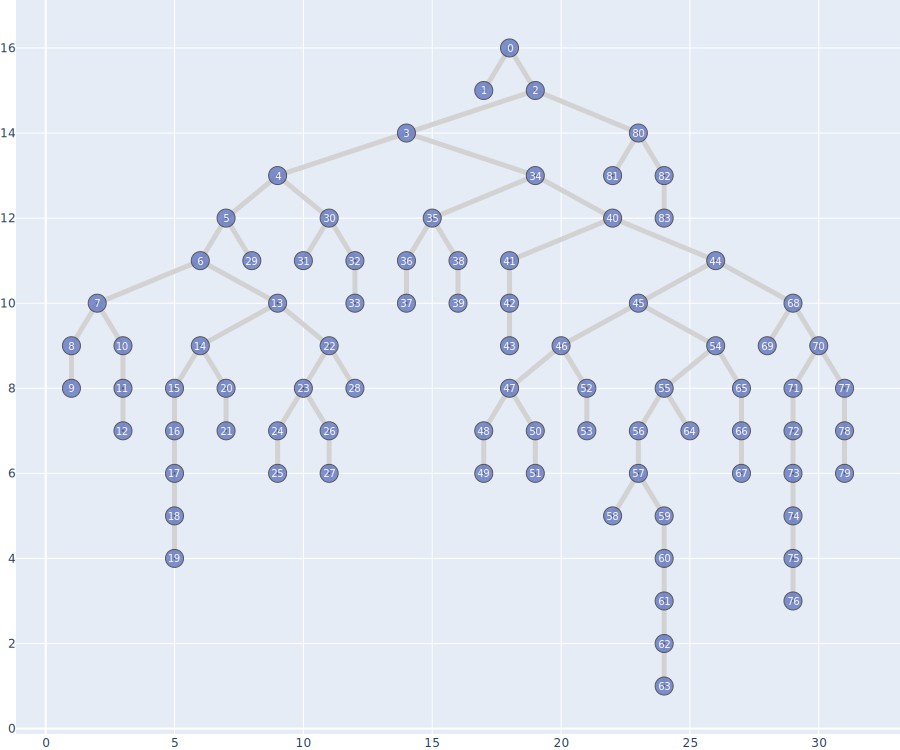
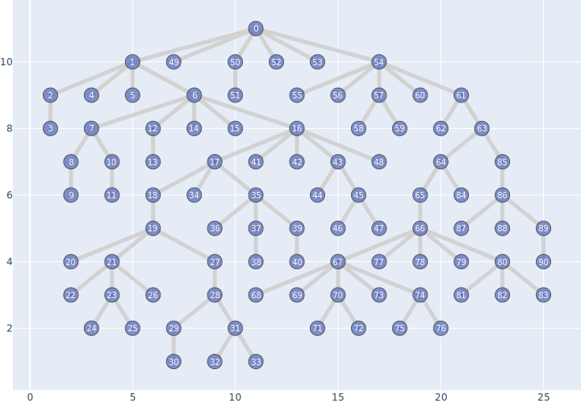

## Визуализация деревьев

Реализован алгоритм Layered-Tree-Draw для произвольных деревьев.

Дерево считывается из формата GraphML, на выходе алгоритма SVG-картинка с визуализацией.

## Запуск кода

### Запуск в ноутбуке на колабе

### Запуск скрипта
python treeviz.py -gp ./graphml_trees/tree-dense.xml -ip ./results/tree-dense.svg

Параметры:
1. GraphPath (-gp) - путь к xml-файлу с графом в GraphML-формате
2. ImagePath (-ip) - путь к файлу с изображением-результатом (предпочтительный формат - SVG)

## Примеры работы

Примеры деревьев содержатся в директории ./graphml_trees, результаты для них - в директории ./results .

Бинарное дерево

Небинарное плотное дерево

