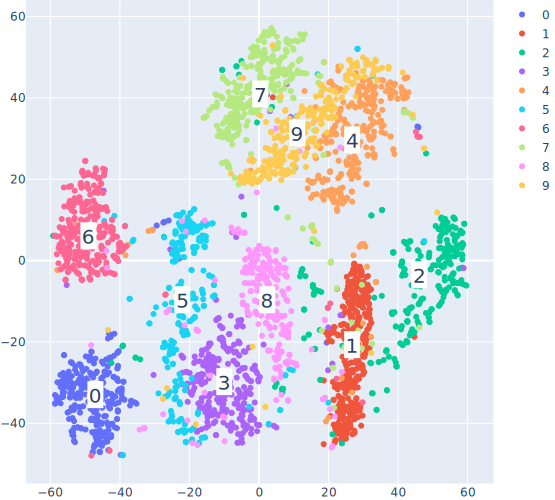
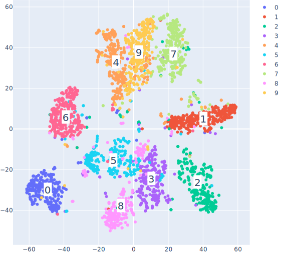

## Алгоритм визуализации многомерных данных T-SNE (T-distributed stochastic neighbour embedding)

Реализован алгоритм T-SNE визуализации многомерных данных. Алгоритм применен к небольшому подмножеству примеров датасета MNIST, размерность пространства-образа равна двум.

## Запуск кода

### Запуск ноутбука на колабе 

### Запуск скрипта
python tsne_mnist.py -mp ./mnist.pkl -ip ./res.svg -up

Параметры:
1. MnistPath (-mp) - путь к файлу с сериализованным mnist-датасетом.
2. ImagePath (-ip) - путь к файлу с изображением-результатом (предпочтительный формат - SVG)
3. UsePCA (-up) - использовать ли PCA для уменьшения размерности перед запуском T-SNE.
## Результаты работы

T-SNE на датасете MNIST (3000 примеров, Perplexity=40):

T-SNE на датасете MNIST с использованием PCA для уменьшения размерности 
(3000 примеров, Perplexity=40, с помощью PCA выбрано 30 главных компонент):

